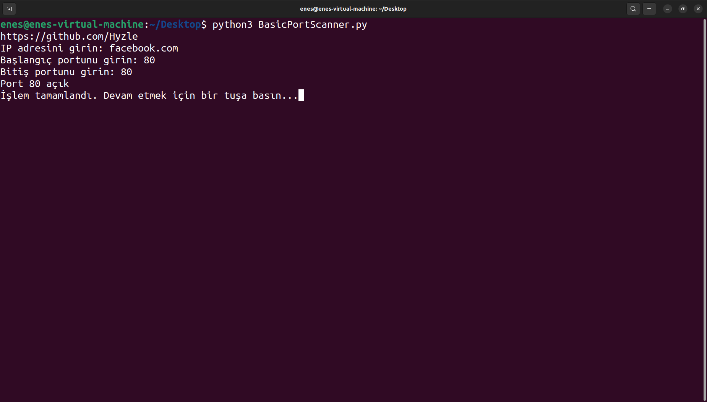
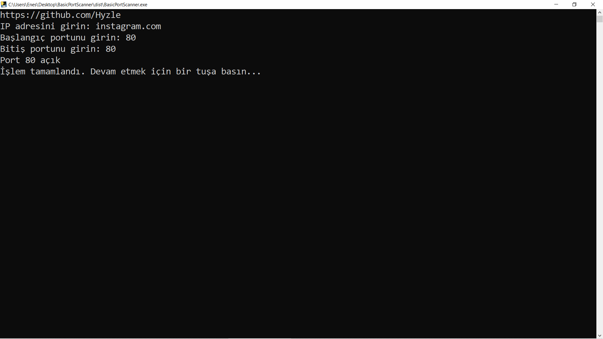

# BasicPortScanner
A basic Port Scanner :mag_right: using python <br>
# How To Use :
First Input : Ip Adress <br> <br>
Second Input : Start Port <br> <br>
Third Input : End Port <br> <br>

## Requirement :rotating_light:

 [](https://www.python.org/)

- **Python** `>= v2.7.0`
    - Install Python from [here](https://www.python.org/).
    
- **Pip** `>= v9.0.1`
    - Install pip from [here](https://pip.pypa.io/en/stable/installing/).

# installing:

  <h3>Debian based systems:</h3>

```
$ sudo apt-get update && sudo apt-get install python3 python3-pip -y

$ git clone https://github.com/Hyzle/BasicPortScanner

$ cd BasicPortScanner/

$ python3 -m pip install -r requirements.txt
```

  <h3>macOS / OSX:</h3>

```
$ brew install python3

$ git clone https://github.com/Hyzle/BasicPortScanner

$ cd BasicPortScanner/

$ python3 -m pip install -r requirements.txt
```
## Tested On : 
<br> Ubuntu (Linux) and Windows 10 Pro  <br> <br> 
## Screenshots : <br> <br>
 <br> <br> 

# disclaimer:
  I'm not responsible for anything you do with this program, so please only use it for good and educational purposes.
